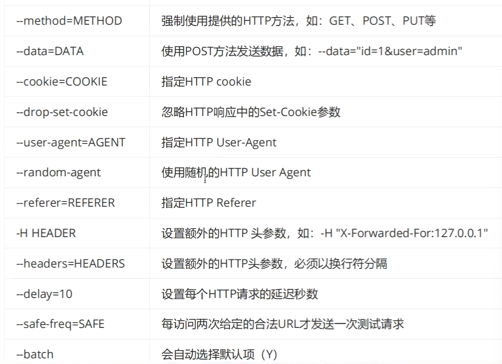
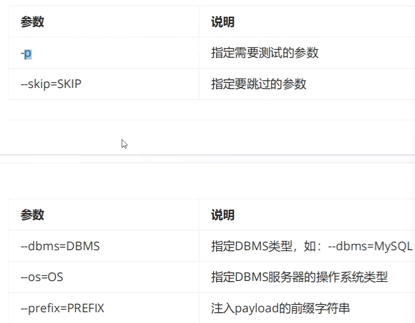
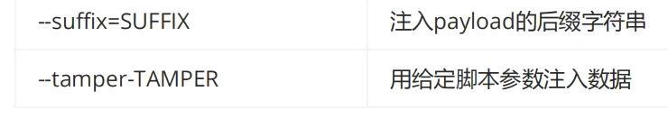
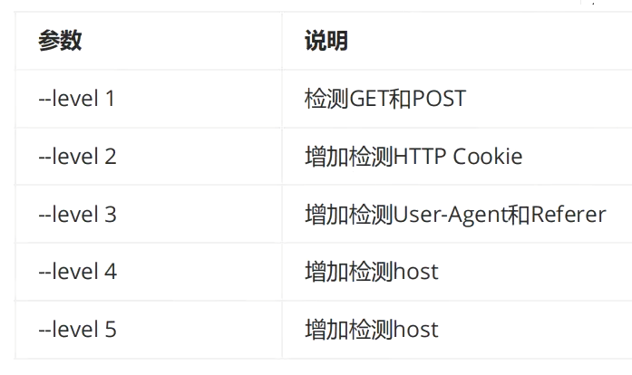
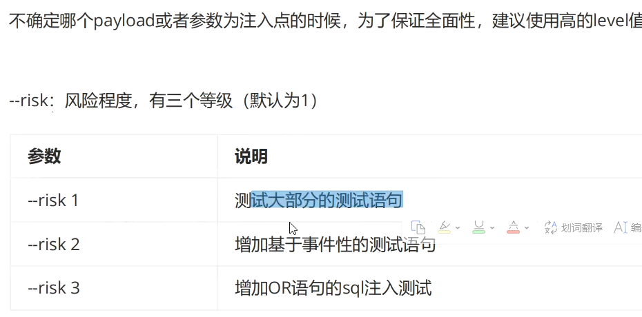
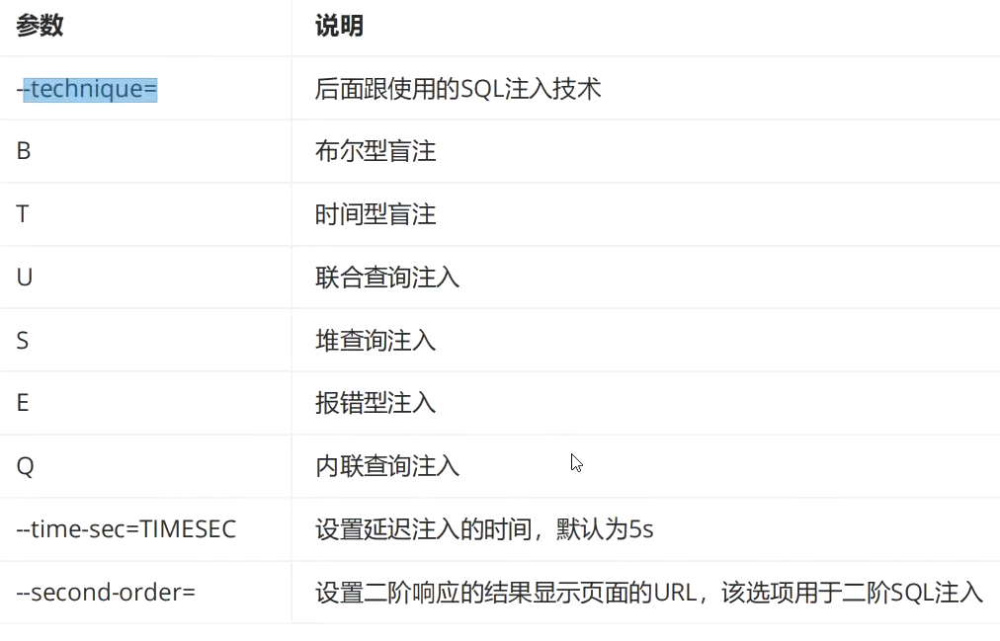
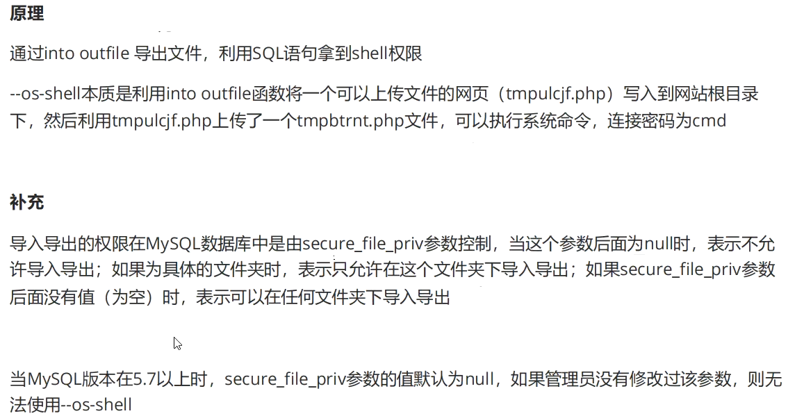

# sqlmap
-v
输出等级

1.目标参数:
-d 直连数据库
-u URL
-I 从Rurp代理日志文件中解析目标地址
-m 从文本文件中批量获取目标
-r 从文件中读取http请求

2.数据包设置

3.注入参数

4.检测参数

 5.注入类型

6.枚举参数
-a 所有数据
-b --banner 获取banner,返回版本号
--current-db 获取当前数据库
--current-user获取当前用户
--hostname 服务器主机名
--users 所有用户
--passwords所有用户名密码
--privileges 所有用户特权级
--roles 所有用户角色
--dbs 所有数据库
--tables 数据库中的表名
--columns 指定表的所有列
--schema 所有模式
--count 数据表的数目
--dump 导出数据表项
-D
-T
-C
--sql-query=QUERY 指定要执行的sql语句
--sql-shell 交互式SQL shell

系统交互时shell
--os-shell

使用条件:
需知道网站的绝对路径(sql中可爆破)
用户账号权限为管理员
Gpc为off,php主动转向的功能关闭
secure_file_priv为空
